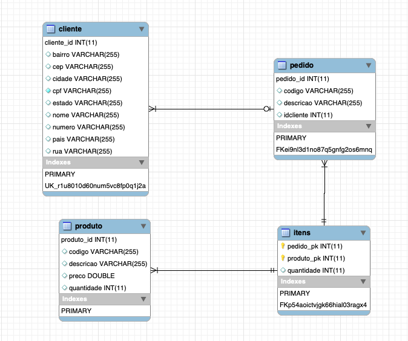

<h1 align="center">E-commerce - Java Persistence</h1>

 

   <a href="#-projeto">Projeto</a>&nbsp;&nbsp;&nbsp;&nbsp;&nbsp;&nbsp;
 

 

    
 

 ## 💻 Projeto

 O objetivo deste projeto é o desenvolvimento de um sistema de cadastro de produtos para um e-commerce, com a utilização das técnicas e formas de persistência em um banco de dados, conhecimento esse apresentado ao decorrer das aulas da disciplina de Java Persistence.

 ---
<h4 align="center">
   Code and coffee ☕
</h4>

